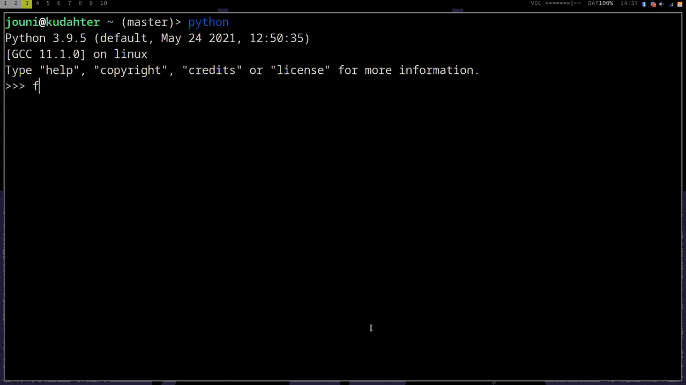

# Mpl Proc
This project allows to use matplotlib interactively.


Just do the following
```
from mpl_proc import MplProc
m = MplProc()
```

And then you can use `m.proxy_ax` and `m.proxy_fig` as if they were `matplotlib`'s `Axes` and `Figure`

More effecient approach is to use `m.call_function`

I made this project to animate my neural net's learning progress.
That's why matplotlib is run in another process.